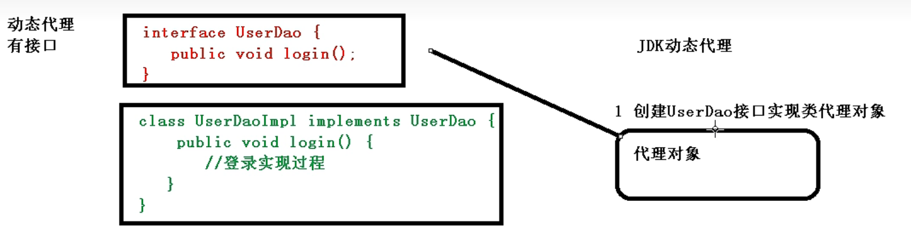

# Spring学习笔记

- [Spring学习笔记](#spring学习笔记)
  - [Spring框架概述](#spring框架概述)
  - [创建一个spring案例](#创建一个spring案例)
    - [注意](#注意)
  - [IOC容器](#ioc容器)
    - [IOC概念和原理](#ioc概念和原理)
  - [AOP原理](#aop原理)
    - [AOP概念和原理](#aop概念和原理)
  - [JdbcTemplate](#jdbctemplate)
  - [事务操作](#事务操作)
  - [Spring5](#spring5)
  - [SpringWebflux](#springwebflux)


[链接-MarkDown语法](https://simimi.cn/note/markdown-basic-syntax/#%E4%B8%80%E3%80%81%E5%9F%BA%E6%9C%AC%E7%AC%A6%E5%8F%B7%EF%BC%9A-gt)

## Spring框架概述

1. Spring是轻量级的开源的JavaEE框架
2. Spring可以解决企业应用开发的复杂性
3. Spring有两个核心部分：IOC和AOP
   (1) IOC:控制反转：把创建对象的过程交给Spring进行管理
   (2) AOP:面向切片，不修改源代码进行功能增强
4. Spring特点
   (1) 方便解耦，简化开发
   (2) AOP编程支持
   (3) 方便程序测试
   (4) 方便和其他框架进行整合
   (5) 方便进行事务操作
   (6) 降低API开发难度
5. 课程以Spring5.x为例

## 创建一个spring案例

1. 修改pom.xml文件

   ```pom.xml
      <?xml version="1.0" encoding="UTF-8"?>
        <project xmlns="http://maven.apache.org/POM/4.0.0"
                xmlns:xsi="http://www.w3.org/2001/XMLSchema-instance"
                xsi:schemaLocation="http://maven.apache.org/POM/4.0.0 http://maven.apache.org/xsd/maven-4.0.0.xsd">
            <modelVersion>4.0.0</modelVersion>

            <groupId>org.example</groupId>
            <artifactId>spring_demo</artifactId>
            <version>1.0-SNAPSHOT</version>

            <dependencies>
                <dependency>
                    <groupId>junit</groupId>
                    <artifactId>junit</artifactId>
                    <version>4.13.2</version>
                </dependency>
                <dependency>
                    <groupId>org.springframework</groupId>
                    <artifactId>spring-context</artifactId>
                    <version>6.0.3</version>
                </dependency>
                <!-- https://mvnrepository.com/artifact/org.apache.logging.log4j/log4j-core -->
                <dependency>
                    <groupId>org.apache.logging.log4j</groupId>
                    <artifactId>log4j-core</artifactId>
                    <version>2.19.0</version>
                </dependency>
                <dependency>
                    <groupId>org.springframework</groupId>
                    <artifactId>spring-test</artifactId>
                    <version>6.0.3</version>
                </dependency>
                <dependency>
                    <groupId>org.projectlombok</groupId>
                    <artifactId>lombok</artifactId>
                    <version>1.18.24</version>
                    <scope>provided</scope>
                </dependency>
            </dependencies>
            <properties>
                <maven.compiler.source>19</maven.compiler.source>
                <maven.compiler.target>19</maven.compiler.target>
            </properties>
        </project>
   ```

2. 编写main包里的代码
   
3. 在resource包里编写spring配置文件
   
4. 在test包里编写测试代码
   
5. 运行测试代码
   

### 注意

+ MAVEN搭建Spring环境
  + 案例
   [链接](https://blog.csdn.net/qq_31993621/article/details/82470305)  
+ ERROR:JAVA: 错误: 不支持发行版本 5  
  + 解决方法
   [链接](https://eli-coin.blog.csdn.net/article/details/119142118?spm=1001.2014.3001.5506)

## IOC容器

1. IOC底层原理
2. IOC接口(BeanFactory)
3. IOC操作Bean管理(基于xml)
4. IOC操作Bean管理(基于注解)

### IOC概念和原理

+ 什么是IOC
   (1)控制反转，把对象创建和对象之间的调用过程，交给Spring进行管理
   (2)使用IOC目的：为了耦合度降低
   (3)做入门案例就是为了IOC实现

+ IOC底层原理
   (1)xml解析，工厂模式，反射

+ 画图讲解IOC底层原理
   目的：将耦合度降低到能够满足设计需求的最低限度
   
   

+ IOC接口
   1. IOC思想基于IOC容器完成，IOC容器底层就是对象工厂
   2. Spring提供IOC容器实现两种方式：（两个接口）
   (1)BeanFactory:IOC容器的基本实现，是Spring内部的使用接口，不提供开发人员进行使用。加载配置文件时候不会创建对象，在获取对象(使用)时才会创建对象(懒加载)
   (2)ApplicationContext：BeanFactory接口的子接口，提供了更多更强大的功能，一般面向开发人员使用。加载配置文件时候就会把在配置文件中的对象创建(预加载)
   3. ApplicationContext接口有实现类
   

+ IOC操作Bean管理
   1. 什么是Bean管理
   (1)Spring创建对象
   (2)Spring注入属性
   2. Bean管理操作有两种方式
   (1)基于xml配置文件方式实现
   (2)基于注解方式实现

+ IOC操作Bean管理(基于xml方式)
   1. 基于xml方式创建对象
   
   2. 基于xml方式注入属性
   3. p名称空间注入
   
   第一种：
   (1)创建类，定义属性和对应的set方法
   
   (2)在spring配置文件配置对象创建
   效果类似于下图
   
   
   
   第二种：使用有参数构造进行注入
   (1)创建类，定义属性，创建属性对应有参数构造方法
   
   
   第三种：基于p名称空间注入，可以简化基于xml配置方式
   （1）添加p名称空间在配置文件中
   
   (2)进行属性注入，在bean标签里面操作
   

+ IOC操作Bean管理(xml注入其他类型属性)

   1. 字面量
   (1)null值
      
   (2)属性值中包含特殊符号，比如<>
      第一种：把<>进行转义
      第二种：把带特殊符号内容写到CDATA
      
   2. 注入属性-外部bean
      (1)创建两个类service类和dao类
      (2)在service调用dao里面的方法
      (3)在spring配置文件中进行配置
      
   3. 注入属性-内部bean
      (1)一对多关系：部门和员工
      一个部门有多个员工，一个员工属于一个部门
      部门是一，员工是多
      (2)在实体类之间表示一对多关系,员工的所属部门，使用对象类型属性进行表示
      
      
      (3)在spring配置文件中进行配置
      
      注意：如果输出bean@地址，需要重写toString方法
   4. 注入属性-级联赋值
      在spring配置文件中进行配置

        ```123
        <!--     级联赋值-->
        <bean id="emp" class="bean.Emp">
        <!--        设置两个普通属性-->
                <property name="ename" value="David"></property>
                <property name="gender" value="男"></property>
        <!--    级联赋值-->
                <property name="dept" ref="dept"></property>
        <!--        <property name="dept.dname" value="技术部"></property>-->
            </bean>
            <bean id="dept" class="bean.Dept">
                <property name="dname" value="财务部"></property>
            </bean>
        ```

        作为对比，这是外部bean  

        ```123
            <!--    1.service和dao对象创建-->
                <bean id="userService" class="service.UserService">
            <!--        注入userDao对象
                        name属性值：类里面属性名称
                        ref属性：创建userDao对象bean标签id值
            -->
                    <property name="userDao" ref="userDao"></property>
                </bean>
                <bean id="userDao" class="dao.UserDaoImpl"></bean>
        ```

+ IOC操作Bean管理(xml注入集合属性)

   1. 注入数组类型属性
   2. 注入List集合类型属性
   3. 注入Map集合类型属性
      (1) 创建类，定义数组，list，map，set类型，生成对应set方法
      
      (2) 在spring配置文件中进行配置
   4. 在集合类型里面设置对象类型值
   5. 把集合注入部分提取出来

        ```123
        public class Stu {
            //1 数组类型属性
            private String[] course;
            //2 list集合类型属性
            private List<String> list;
            //3 map集合类型属性
            private Map<String,String>maps;
            //4 set集合类型属性
            private Set<String>sets;

            //学生所学多门课程
            private List<Course>courseList;

            public void setCourseList(List<Course> courseList) {
                this.courseList = courseList;
            }

            public void setCourse(String[] course) {
                this.course = course;
            }

            public void setList(List<String> list) {
                this.list = list;
            }

            public void setMaps(Map<String, String> maps) {
                this.maps = maps;
            }

            public void setSets(Set<String> sets) {
            this.sets = sets;
            }

            public void test(){
                System.out.println(Arrays.toString(course));
                System.out.println(list);
                System.out.println(maps);
                System.out.println(sets);
                System.out.println(courseList);
            }
        }
        ```

        ```123
        <bean id="stu" class="com.example.Stu">
            <!--数组类型属性注入-->
                    <property name="course">
                        <array>
                            <value>Java课程</value>
                            <value>数据库课程</value>
                        </array>
                    </property>
            <!--list类型注入-->
                    <property name="list">
                        <list>
                            <value>张三</value>
                            <value>张饼子</value>
                        </list>
                    </property>
            <!--map类型注入-->
                    <property name="maps">
                        <map>
                            <entry key="JAVA" value="java"></entry>
                            <entry key="PHP" value="php"></entry>
                        </map>
                    </property>
            <!--set类型注入-->
                <property name="sets">
                    <set>
                        <value>MySQL</value>
                        <value>Redis</value>
                    </set>
                </property>
        ```

        ```4
        public class Course {
            private String cname;  //课程名称

            public void setCname(String cname) {
                this.cname = cname;
            }

            @Override
            public String toString() {
                return "Course{cname="+cname+"}";
            }
        }
        ```

        ```4
        <!--注入list集合类型，值是对象-->
                <property name="courseList">
                    <list>
                        <ref bean="course1"></ref>
                        <ref bean="course2"></ref>
                    </list>
                </property>
            </bean>
            <bean id="course1" class="com.example.Course">
                <property name="cname" value="Spring框架"></property>
            </bean>
            <bean id="course2" class="com.example.Course">
                <property name="cname" value="MyBatis框架"></property>
            </bean>
        ```

        ```5
        <!--1 提取list集合类型属性注入-->
            <util:list id="booklist">
                <value>猫和老鼠</value>
                <value>翡冷翠的一夜</value>
                <value>哈利波特</value>
            </util:list>

            <!--2 提取list集合类型属性注入使用-->
            <bean id="book" class="com.example.Book">
                <property name="list" ref="booklist"></property>
            </bean>
        ```

+ IOC操作Bean管理(FactoryBean)
   1. Spring有两2.种类型bean，一种是普通bean，另外一种工厂bean(FactoryBean)
   2. 普通bean:在配置文件中定义bean类型就是返回类型
   3. 工厂bean：在配置文件定义bean类型可以和返回类型不一样(可以修改默认返回的bean类型)
   第一步 创建类，让这个类作为工厂bean，实现接口FactoryBean
   第二步 实现接口里面的方法，在实现的方法中定义返回的bean类型
   
   
   

+ IOC操作Bean管理(bean作用域)
  1. 在Spring里边，设置创建bean实例是单实例还是多实例
  2. 在Spring里面，默认情况下，bean是单实例对象
   如图，地址相同
   
  3. 如何设置单实例还是多实例
   (1)在spring配置文件bean标签里面有属性用于设置单实例还是多实例
   (2)scope属性值
   第一个值：默认值，singleton，表示单实例对象
   第二个值：prototype，表示多实例对象
   
   
   (3)singleton和prototype区别
   第一：singleton单实例，prototype多实例
   第二：设置scope值是singleton时，加载spring配置文件就会创建单实例对象；设置scope值是prototype时候，不是在加载spring配置文件时候创建对象，在调用getBean方法时创建多实例对象。

+ IOC操作Bean管理(bean生命周期)
  1. 生命周期
   [链接-参考视频](https://simimi.cn/note/markdown-basic-syntax/#%E4%B8%80%E3%80%81%E5%9F%BA%E6%9C%AC%E7%AC%A6%E5%8F%B7%EF%BC%9A-gt)
   (1)从对象创建到对象销毁的过程
  2. bean生命周期
   (1)通过构造器创建bean实例(无参数构造)
   (2)为bean属性设置值和对其他bean的引用(调用set方法)
   (3)调用bean的初始化的方法(需要进行配置)
   (4)bean可以使用了(获取创建bean实例对象)
   (5)当容器关闭时候，调用bean的销毁方法(需要进行配置销毁的方法)
  3. bean的后置处理器，bean的生命周期完整为七步
   (1)通过构造器创建bean实例(无参数构造)
   (2)为bean属性设置值和对其他bean的引用(调用set方法)
   (3)把bean实例传递bean后置处理器的方法
   (4)调用bean的初始化的方法(需要进行配置)
   (5)把bean实例传递bean后置处理器的方法
   (6)bean可以使用了(获取创建bean实例对象)
   (7)当容器关闭时候，调用bean的销毁方法(需要进行配置销毁的方法)

+ IOC操作自动装配
    1. 什么是自动装配
        (1)根据指定装配规则(属性名称或者属性类型)，Spring自动将匹配的属性值进行注入
    2. 演示自动装配
        (1)根据属性名称自动注入
            实现自动装配
            bean标签属性autowire，配置自动装配
            autowire属性常用两个值：
            byName根据属性名称注入，注入值bean的id值和类属性名称一样
            byType根据属性类型注入
            `<bean id="emp" class="com.example.autowire.Emp" autowire="byName"></bean>`
            `<bean id="dept" class="com.example.autowire.Dept"></bean>`

+ IOC操作Bean管理(外部属性文件)
  1. 直接配置数据库信息
   (1)配置德鲁伊连接池

        ```添加依赖
        <dependency>
            <groupId>com.alibaba</groupId>
            <artifactId>druid</artifactId>
            <version>1.2.15</version>
        </dependency>
        <dependency>
            <groupId>org.aspectj</groupId>
            <artifactId>aspectjweaver</artifactId>
            <version>1.9.19</version>
        </dependency>
        ```

  2. 引入外部属性文件配置数据库连接池
   (1)创建外部属性文件，properties格式文件，写数据库信息
   
  3. 把外部properties属性引入到spring配置文件中
     (1) 引入context名称空间

        ```名称空间
            xmlns="http://www.springframework.org/schema/beans"
            xmlns:xsi="http://www.w3.org/2001/XMLSchema-instance"
            xmlns:context="http://www.springframework.org/schema/context"
            xsi:schemaLocation="http://www.springframework.org/schema/beans http://www.springframework.org/schema/beans/spring-beans.xsd
                                http://www.springframework.org/schema/util http://www.springframework.org/schema/beans/spring-util.xsd
                                http://www.springframework.org/schema/context http://www.springframework.org/schema/beans/spring-context.xsd">
        ```

      (2) 在spring配置文件中使用标签引入外部属性文件

     ```引入
            <context:property-placeholder location="classpath:jdbc.properties"></context:property-placeholder>
            <bean id="dataSource" class="com.alibaba.druid.pool.DruidDataSource">
                <property name="driverClassName" value="${prop.driverClass}"></property>
                <property name="url" value="${prop.url}"></property>
                <property name="username" value="${prop.userName}"></property>
                <property name="password" value="${prop.password}"></property>
            </bean>
     ```

+ IOC操作Bean管理(基于注解方式)
  1. 什么是注解
   (1) 注解是代码特殊标记，格式：@注解名称(属性名称=属性值，属性名称=属性值...)
   (2) 使用注解：注解作用在类上面，方法上面，属性上面
   (3) 使用注解目的：简化xml配置
  2. Spring针对Bean管理中创建对象提供注解
   (1)@Component
   (2)@Service
   (3)@Controller
   (4)@Respository
   上面四个注解功能是一样的，都可以用来创建bean实例
  3. 基于注解方式实现对象创建
     (1)引入依赖

        ```引入依赖
            <dependency>
                <groupId>org.aspectj</groupId>
                <artifactId>aspectjweaver</artifactId>
                <version>1.9.19</version>
            </dependency>
            <dependency>
                <groupId>org.springframework</groupId>
                <artifactId>spring-aop</artifactId>
                <version>6.0.3</version>
            </dependency>
            <dependency>
                <groupId>org.springframework</groupId>
                <artifactId>spring-aspects</artifactId>
                <version>6.0.3</version>
            </dependency>
        ```

     (2) 开启组件扫描

        ```开启
            xmlns="http://www.springframework.org/schema/beans"
            xmlns:xsi="http://www.w3.org/2001/XMLSchema-instance"
            xmlns:context="http://www.springframework.org/schema/context"
            xsi:schemaLocation="http://www.springframework.org/schema/beans http://www.springframework.org/schema/beans/spring-beans.xsd
                                http://www.springframework.org/schema/context
                                http://www.springframework.org/schema/context/spring-context.xsd">
                                ...................
                                ...................
            <!--    开启组件扫描
                1 如果扫描多个包，多个包使用逗号隔开
                1 扫描包上层目录-->
            <!--    示例1-->
            <!--    <context:component-scan base-package="com.example.service,com.example.dao"></context:component-scan>-->
            <!--    示例2-->
            <!--    <context:component-scan base-package="com.example"></context:component-scan>-->
            <!--    示例3-->
            <!--    <context:component-scan base-package="com.example" use-default-filters="false">-->
            <!--        <context:include-filter type="annotation" expression="org.springframework.stereotype.Controller"/>-->
            <!--    </context:component-scan>-->
            <!--    示例4-->
            <!--<context:component-scan base-package="com.example">-->
            <!--    <context:exclude-filter type="annotation" expression="org.springframework.stereotype.Controller"/>-->
            <!--</context:component-scan>-->
        ```

     (3) 创建类，在类上面添加创建对象的注解

        ```注解
            //在注解里面value属性值可以省略不写，默认值是类名称首字母小写
            @Component(value = "userService") // <bean id="userService" class="UserService"></bean>
            public class UserService {
                public void add(){
                    System.out.println("Service add...");
                }
            }
        ```

  4. 基于注解方式实现属性注入
    [链接-注解方式](https://blog.csdn.net/qq_44543508/article/details/103695784)
     (1) @AutoWired:根据属性类型进行自动装配
        第一步：把service和dao对象创建，在service和dao
        第二步：在service注入dao对象，在service类添加dao类型属性，在属性上面使用注解

        ```代码
            @Service
            public class UserService {
                //定义dao类型属性
                //添加注入属性注解
                @Autowired  //根据类型进行注入
                private UserDao userDao;
                //不需要添加set方法
                public void add(){
                    System.out.println("Service add...");
                    userDao.add();
                }
            }
            ...
            @Repository(value = "userDaolmpl")
            public class UserDaoImpl implements UserDao {
                @Override
                public void add() {
                    System.out.println("Dao add......");
                }
            }
            ...
            public interface UserDao {
                public void add();
            }
            ...
            public class TestDemo {
                @Test
                public void testService(){
                    ApplicationContext context = new ClassPathXmlApplicationContext("spring.xml");
                    UserService userService = context.getBean("userService", UserService.class);
                    userService.add();
                    System.out.println(userService);
                }
            }
        ```

     (2) @Qualifier:根据属性名称进行注入

        ```代码
            @Service
            public class UserService {
                //定义dao类型属性
                //添加注入属性注解
                @Autowired  //根据类型进行注入
                @Qualifier(value = "userDaolmpl")
                private UserDao userDao;
                //不需要添加set方法
                public void add(){
                    System.out.println("Service add...");
                    userDao.add();
                }
            }
            ...
            @Repository(value = "userDaolmpl")
            public class UserDaoImpl implements UserDao {
                @Override
                public void add() {
                    System.out.println("Dao add......");
                }
            }
        ```

     (3) @Resource:可以根据类型注入，也可以根据名称注入
     (4) @Value:注入普通类型属性

  5. 完全注解开发
     (1)创建配置类,替换xml配置文件

        ```代码
            @Configuration  //作为配置类，替换xml配置文件
            @ComponentScan(basePackages = {"com.example"})

            ···

            @Test
            public void test_1(){
                ApplicationContext context = new ClassPathXmlApplicationContext("spring.xml");
                UserService userService = context.getBean("userService", UserService.class);
                userService.test();
                System.out.println(userService);
            }
            //对比
            @Test
            public void test_2(){
                ApplicationContext context = new AnnotationConfigApplicationContext(SpringConfig.class);
                UserService userService = context.getBean("userService", UserService.class);
                userService.test();
                System.out.println(userService);
            }
            ```

## AOP原理

1. AOP底层原理
2. AOP操作

### AOP概念和原理

+ 什么是AOP
   (1) 面向切面编程(方面)，利用AOP可以对业务逻辑的各个部分进行隔离，从而使得业务逻辑各部分之间耦合度降低，提高程序的可用性，同时提高了开发的效率
   (2) 通俗描述：不通过修改源代码方式，在主干功能里面添加功能
   (3)例子说明
   

+ AOP(底层原理)
  
  1. AOP底层使用动态代理
    (1)有两种情况动态代理
    第一种 有接口情况，使用JDK动态代理
    创建接口实现类代理对象，增强类的方法
        
    第二种 没有接口，使用CGLIB动态代理
    创建子类的代理对象，增强类的方法
        

  2. AOP动态代理实例
       + 使用JDK动态代理，使用Proxy类里面的方法创建代理对象
          > static Object     newProxyInstance(ClassLoader loader,类<?>[] interfaces,InvocationHandler h)(返回指定接口的代理类的实例，该接口将方法调用分配给指定的调用处理程序)
     (1)调用newProxyInstance方法
        方法有三个参数：
        第一参数，类加载器
        第二参数，增强方法所在的类，这个类实现的接口，支持多个接口
        第三参数，实现这个接口InvocationHandler，创建代理对象，写增强的方法
       + 代码
        (1)创建接口，定义方法
        (2)创建接口实现类，实现方法
        (3)使用Proxy类创建接口代理对象

            ```代码
            public interface UserDao {
                public int add(int a,int b);

                public String update(String id);
            }
            ...
            public class UserDaoImpl implements UserDao {
                @Override
                public int add(int a, int b) {
                    return a+b;
                }
                @Override
                public String update(String id) {
                    return id;
                }
            }
            ...
            package com.example.service;

            import java.lang.reflect.InvocationHandler;
            import java.lang.reflect.Method;
            import java.lang.reflect.Proxy;
            import java.util.Arrays;

            public class JDKProxy {
                public static void main(String[] args) {
                    //创建接口实现类代理对象
                    Class[] interfaces = {UserDao.class};
            //        Proxy.newProxyInstance(JDKProxy.class.getClassLoader(), interfaces, new InvocationHandler() {
            //            @Override
            //            public Object invoke(Object proxy, Method method, Object[] args) throws Throwable {
            //                return null;
            //            }
            //        });
                    UserDaoImpl userDao = new UserDaoImpl();
                    UserDao dao = (UserDao)Proxy.newProxyInstance(JDKProxy.class.getClassLoader(), interfaces, new UserDaoProxy(userDao));
                    int result = dao.add(1,2);
                    System.out.println("result:"+result);
                }
            }

            //创建代理对象代码
            class UserDaoProxy implements InvocationHandler{
                //1 创建的是谁的代理对象，把谁传递过来
                //有参构造传递
                private Object obj;
                public  UserDaoProxy(Object obj) {
                    this.obj = obj;
                }

                //增强的逻辑
                @Override
                public Object invoke(Object proxy, Method method, Object[] args) throws Throwable {
                    //方法之前
                    System.out.println("方法之前执行"+method.getName()+":传递的参数..."+ Arrays.toString(args));

                    //被增强的方法执行
                    Object res = method.invoke(obj,args);

                    //方法之后
                    System.out.println("方法之后执行..."+obj);

                    return res;
                }
            }

            ```

+ AOP(术语)  
  1. 连接点
    类里面哪些方法可以被增强，这些方法称为连接点
  2. 切入点
    实际被真正增强的方法，称为切入点
  3. 通知(增强)
    (1)实际增强的逻辑部分称为通知(增强)
    (2)通知有多种类型
        前置通知
        后置通知
        环绕通知
        异常通知
        最终通知 finally
  4. 切面
    是动作
    (1)把通知应用到切入点过程

+ AOP操作(准备)
  1. Spring框架一般都是基于AspectJ实现AOP操作
    (1)什么是AspectJ
     Aspectj不是Spring组成部分，独立AOP框架，一般和Spring一起使用，进行AOP操作
  2. 基于AspectJ实现AOP操作
    (1)基于xml配置文件实现
    (2)基于注解方式实现(使用)
  3. 在项目工程里面引入AOP相关依赖
  4. 切入点表达式
    (1)切入点表达式作用：知道对哪个类里面的哪个方法进行增强
    (2)语法结构:
     `execution([权限修饰符][返回类型][类全路径][方法名称][参数列表])`
     举例1：对com.atguigu.dao.BookDao类里面的add进行增强
     `execution(* com.atguigu.dao.BookDao.add(...))`
     举例2：对com.atguigu.dao.BookDao类里面的所有方法进行增强
     `execution(* com.atguigu.dao.BookDao.*)`
     举例3：对com.atguigu.dao包里面所有类，类里面的所有方法进行增强
     `execution(* com.atguigu.dao.*.*)`

+ AOP操作(AspectJ注解)
    1. 创建类，在类里面定义方法
    2. 创建增强类(编写增强的逻辑)
       (1)在增强类里面，创建方法，让不同的方法代表不同通知类型
    3. 进行通知的配置
       (1)在spring配置文件中，开启注解扫描
       (2)使用注解创建User和UserProxy对象
       (3)在增强类上面添加注解@Aspect
       (4)在spring配置文件中开启生成代理对象
    4. 配置不同类型的通知
        (1)在增强类的里面,在作为通知的方法上面添加通知类型注解，使用切入点表达式配置
    5. 公共切入点抽取
    6. 有多个增强类对同一个方法进行增强，设置增强类优先级
      (1)在增强类上面添加注解@Order(数字类型值)，数字类型值越小优先级越高
       > @Component @Aspect @Order(1)

    ```代码
        //1创建类，在类里面定义方法
        public class User {
            public void add(){
            System.out.println("add...");
            }
        }
        ...
        //2创建增强类(编写增强的逻辑)
        //增强的类
        public class UserProxy {
            //作为前置通知
            public void before(){
                System.out.println("before...");
            }
        }
        ...
        //3.1在spring配置文件中，开启注解扫描
        <?xml version="1.0" encoding="UTF-8"?>
        <beans xmlns="http://www.springframework.org/schema/beans"
            xmlns:xsi="http://www.w3.org/2001/XMLSchema-instance"
            xmlns:aop="http://www.springframework.org/schema/aop"
            xmlns:context="http://www.springframework.org/schema/context"
            xsi:schemaLocation="http://www.springframework.org/schema/beans http://www.springframework.org/schema/beans/spring-beans.xsd
                http://www.springframework.org/schema/context http://www.springframework.org/schema/context/spring-context.xsd
                http://www.springframework.org/schema/aop http://www.springframework.org/schema/aop/spring-aop.xsd">
        <!--        开启注解扫描-->
                <context:component-scan base-package="com.example.service"></context:component-scan>
        <!--        开启Aspect生成代理对象-->
                <aop:aspectj-autoproxy proxy-target-class="true"></aop:aspectj-autoproxy>
        </beans>
        ...
        //3.2使用注解创建User和UserProxy对象
        @Component
        public class UserProxy {
        ...
        @Component
        public class User {
        ...
        //3.3在增强类上面添加注解@Aspect
        @Component
        @Aspect
        public class UserProxy {
        //3.4在spring配置文件中开启生成代理对象
        <!--        开启Aspect生成代理对象-->
        <aop:aspectj-autoproxy></aop:aspectj-autoproxy>
        //4配置不同类型的通知
        package com.example.service;

        import org.aspectj.lang.ProceedingJoinPoint;
        import org.aspectj.lang.annotation.*;
        import org.springframework.stereotype.Component;

        //增强的类
        @Component
        @Aspect
        public class UserProxy {
            //前置通知
            @Before(value = "execution(* com.example.service.User.add())")
            public void before(){
                System.out.println("before...");
            }
            //最终通知
            @After(value = "execution(* com.example.service.User.add())")
            public void after(){
                System.out.println("after...");
            }
            //后置通知(返回通知)
            @AfterReturning(value = "execution(* com.example.service.User.add())")
            public void afterReturn(){
                System.out.println("afterReturn...");
            }
            @AfterThrowing(value = "execution(* com.example.service.User.add())")
            public void afterThrowing(){
                System.out.println("afterThrowing...");
            }
            //环绕通知
            @Around(value = "execution(* com.example.service.User.add())")
            public void around(ProceedingJoinPoint proceedingJoinPoint) throws Throwable{
                System.out.println("环绕之前");
                //被增强的方法执行
                proceedingJoinPoint.proceed();
                System.out.println("环绕之后");
            }
        }
        ...
        //5公共切入点抽取
        //相同切入点抽取
        @Pointcut(value = "execution(* com.example.service.User.add())")
        public void pointdemo(){

        }
        //作为前置通知
        @Before(value = "pointdemo()")
        ```

  

+ AOP操作(AspectJ配置文件)
    1. 创建两个类，增强类和被增强类，创建方法
    2. 在spring配置文件中创建两个类对象
    3. 在spring配置文件中配置切入点

注：完全注解AspectJ(不需要xml配置文件)


## JdbcTemplate

+ JdbcTemplate(概念和准备)
    1. 什么是JdbcTemplate
      (1)Spring框架对JDBC进行封装，使用JdbcTemplate方便实现对数据库操作
    2. 准备工作
       (1)引入相关依赖

       ```代码
        <dependency>
            <groupId>mysql</groupId>
            <artifactId>mysql-connector-java</artifactId>
            <version>8.0.30</version>
        </dependency>
        <dependency>
            <groupId>org.springframework</groupId>
            <artifactId>spring-jdbc</artifactId>
            <version>6.0.3</version>
        </dependency>
        <dependency>
            <groupId>org.springframework</groupId>
            <artifactId>spring-tx</artifactId>
            <version>6.0.3</version>
        </dependency>
        <dependency>
            <groupId>org.springframework</groupId>
            <artifactId>spring-orm</artifactId>
            <version>6.0.3</version>
        </dependency>
       ```

       (2)配置数据库连接池

       ```代码
        <bean id="dataSource" class="com.alibaba.druid.pool.DruidDataSource" destroy-method="close">
            <property name="url" value="jdbc:mysql:///user_db"></property>
            <property name="username" value="root"></property>
            <property name="password" value="root"></property>
            <property name="driverClassName" value="com.mysql.jdbc.jc.Driver"></property>
        </bean>
       ```

        注意：问题所在：在查阅相关资料之后，得知是由于jdbc驱动包名引发的问题
        5.x版本的驱动文件jar包对应的是：
        Class.forName("com.mysql.jdbc.Driver");
        语句来加载数据库驱动

        而我使用的是8.0x版本的数据库驱动文件，对此，需要将加载数据库驱动的语句更改为：
        Class.forName("com.mysql.cj.jdbc.Driver");
       (3)配置JdbcTempla对象，注入DataSource

       ```代码
        <!--JdbcTemplate对象-->
        <bean id="jdbcTemplate" class="org.springframework.jdbc.core.JdbcTemplate">
                <!--注入dataSource-->
                <property name="dataSource" ref="dataSource"></property>
        </bean>
       ```

       (4)创建service类，创建dao类，在dao注入jdbcTemplate对象

       ```配置文件
            <!--组件扫描-->
            <context:component-scan base-package="com.example"></context:component-scan>
       ```

       ```service
        @Service
        public class BookService {
            //注入dao
            @Autowired
            private BookDao bookDao;
        }
       ```

       ```dao
        @Repository
        public class BookDaoImpl implements BookDao{
            //注入jdbcTemplate
            @Autowired
            private JdbcTemplate jdbcTemplate;
        }
       ```

+ JdbcTemplate操作数据库(添加)
    1. 对应数据库创建实体类

       ```代码
        private String userID;
        private String userName;
        private String uStatus;

        public void setUserID(String userID) {
            this.userID = userID;
        }

        public void setUserName(String userName) {
            this.userName = userName;
        }

        public void setUStatus(String uStatus) {
            this.uStatus = uStatus;
        }

        public String getUserID() {
            return userID;
        }

        public String getUserName() {
            return userName;
        }

        public String getUStatus() {
            return uStatus;
        }
       ```

    2. 编写service和dao
     (1)在dao进行数据库添加操作
       > update(String sql,Object...args)
       >有两个参数，第一个:sql语句，第二个:可变参数，设置sql语句值

        ```代码
            @Repository
            public class BookDaoImpl implements BookDao {
                //注入jdbcTemplate
                @Autowired
                private JdbcTemplate jdbcTemplate;

                @Override
                public void add(Book book) {
                    System.out.println("添加书本");
                    //1 创建sql语句
                    String sql = "insert into t_book values(?,?,?)";
                    //2 调用方法实现
                    Object[] args = {book.getUserID(),book.getUserName(),book.getUStatus()};
                    int update = jdbcTemplate.update(sql,args);
                    System.out.println(update);
                }

            }
       ```

    3. 测试类

        ```代码
            public class TestDemo {
            @Test
            public void test(){
                ApplicationContext context = new ClassPathXmlApplicationContext("spring.xml");
                BookService bookService = context.getBean("bookService", BookService.class);
                Book book = new Book();
                book.setUserID("1");
                book.setUserName("JAVA基础");
                book.setUStatus("A");
                bookService.addBook(book);
            }

        }
        ```

+ JdbcTemplate操作数据库(修改，删除)

    ```代码
        //修改
        @Override
        public void updateBook(Book book) {
            String sql = "update t_book set name=?,status=? where id=?";
            Object[] args = {book.getUserName(),book.getUStatus(),book.getUserID()};
            int update = jdbcTemplate.update(sql,args);
            System.out.println(update);
        }
        //删除
        @Overrideee
        public void delete(String bookID) {
            String sql = "delete from t_book  where id=?";
            Object[] args = {bookID};
            int update = jdbcTemplate.update(sql,args);
            System.out.println(update);
        }

        ...
        @Test
        public void testUpdate(){
            ApplicationContext context = new ClassPathXmlApplicationContext("spring.xml");
            BookService bookService = context.getBean("bookService", BookService.class);
            Book book = new Book();
            book.setUserID("1");
            book.setUserName("Python基础");
            book.setUStatus("P");
            bookService.updateBook(book);
        }
        @Test
        public void testDelate(){
            ApplicationContext context = new ClassPathXmlApplicationContext("spring.xml");
            BookService bookService = context.getBean("bookService", BookService.class);
            Book book = new Book();
            book.setUserID("1");
            bookService.delateBook(book.getUserID());
        }
    ```

+ JdbcTemplate操作数据库(查询)
    1. 查询表里面有多少条记录，返回是某个值
       >select count(*) from t_book
       > jdbcTemplate.queryForObject(...)
    2. 使用JdbcTemplate实现查询返回某个值代码
        

        ```代码
            @Override
            public int selectCount() {
                String sql = "select count(*) from t_book";
                int count = jdbcTemplate.queryForObject(sql,Integer.class);
                return count;
            }
        ```

+ JdbcTemplate操作数据库(查询返回对象)
    1. 场景:查询图书的详情
    2. JdbcTemplate实现查询返回对象
        
        第一个参数:sql语句
        第二个参数:RowMapper，是接口，返回不同类型的数据，使用这个接口里面实现类完成数据封装
        第三个参数:sql语句值

        ```代码
            @Override
            public Book findBookInfo(String bookID) {
                String sql = "select * from t_book where id=?";
                Book book = jdbcTemplate.queryForObject(sql,new BeanPropertyRowMapper<Book>(Book.class),bookID);
                return book;
            }
        ```

+ JdbcTemplate操作数据库(查询返回集合)
    1. 场景:查询图书列表分页
    2. 调用JdbcTemplate方法实现查询返回集合
        
        第一个参数:sql语句
        第二个参数:RowMapper，是接口，返回不同类型的数据，使用这个接口里面实现类完成数据封装
        第三个参数:sql语句值

        ```代码
            String sql = "select * from t_book";
            //调用方法
            List<Book> bookList = jdbcTemplate.query(sql,new BeanPropertyRowMapper<Book>(Book.class));
            return bookList;
        ```

+ JdbcTemplate操作数据库(批量添加)
    1. 批量操作：操作表里面多条操作
    2. JdbcTemplate实现批量操作
        

        ```代码
            @Override
            public void bacthAddBook(List<Object[]> batchArgs) {
                String sql = "insert into t_book values(?,?,?)";
                int[] ints = jdbcTemplate.batchUpdate(sql,batchArgs);
                System.out.println(Arrays.toString(ints));
            }

            ...
            @Test
            public void testBatchAdd(){
                ApplicationContext context = new ClassPathXmlApplicationContext("spring.xml");
                BookService bookService = context.getBean("bookService", BookService.class);
                List<Object[]> batchArgs = new ArrayList<>();
                Object[] o1 = {"4","MySQL基础","A"};
                Object[] o2 = {"5","JavaScript基础","A"};
                Object[] o3 = {"6","Linux基础","A+"};
                batchArgs.add(o1);
                batchArgs.add(o2);
                batchArgs.add(o3);
                bookService.batchAdd(batchArgs);
            }
        ```

+ JdbcTemplate操作数据库(批量修改删除)
    1. 批量操作：操作表里面多条操作
    2. JdbcTemplate实现批量操作
        代码类似批量添加

注意：如果null的，检查表里的字段名和Book类里的变量名是否保持一致(不能一个是ID，一个是userID)

## 事务操作

+ 事务概念
    1. 什么是事务
      (1) 事务是数据库操作最基本单元，逻辑上的一组操作，要么都成功，如果有一个失败所有操作都失败
      (2) 典项场景:银行转账
          A转账100元给B，A少一百，B就要多一百，少一百和多一百必须都成功实现
    2. 事务四大特性(ACID)
        (1) 原子性:
        一个事务（transaction）中的所有操作，要么全部完成，要么全部不完成，不会结束在中间某个环节。事务在执行过程中发生错误，会被恢复（Rollback）到事务开始前的状态，就像这个事务从来没有执行过一样。
        (2) 一致性:
        在事务开始之前和事务结束以后，数据库的完整性没有被破坏。这表示写入的资料必须完全符合所有的预设规则，这包含资料的精确度、串联性以及后续数据库可以自发性地完成预定的工作。
        (3) 隔离性:
        数据库允许多个并发事务同时对其数据进行读写和修改的能力，隔离性可以防止多个事务并发执行时由于交叉执行而导致数据的不一致。事务隔离分为不同级别，包括读未提交（Read uncommitted）、读提交（read committed）、可重复读（repeatable read）和串行化（Serializable）。
        (4) 持久性:
        事务处理结束后，对数据的修改就是永久的，即便系统故障也不会丢失。

+ 事务操作(搭建事务操作环境)
  > 拓展:MVC框架
    MVC是Model View Controller，是模型(model)－视图(view)－控制器(controller)的缩写，是一种软件设计典范。它是用一种业务逻辑、数据与界面显示分离的方法来组织代码，将众多的业务逻辑聚集到一个部件里面，在需要改进和个性化定制界面及用户交互的同时，不需要重新编写业务逻辑，达到减少编码的时间。
    它强制性地使应用程序的输入、处理和输出分开。使用MVC应用程序被分成三个核心部件：模型、视图、控制器。它们各自处理自己的任务。最典型的MVC就是JSP + servlet + javabean的模式。
    

    1. 创建数据库表，添加记录
        
    2. 创建service，搭建dao，完成对象创建和注入关系
        (1)在service注入dao，在dao注入JdbcTemplate，在JdbcTemplate注入DataSource

        ```代码
            @Repository
            public class UserDaoImpl implements UserDao{
                @Autowired
                private JdbcTemplate jdbcTemplate;

            }
            ...
            @Service
            public class UserService {
                //注入dao
                @Autowired
                private UserDao userDao;
            }
        ```

    3. 在dao创建两个方法，多钱和少钱的方法，在service创建方法(转账的方法)

    ```代码
        @Override
        public void addMoney() {
            String sql = "update t_account set money=money+? where username=?";
            jdbcTemplate.update(sql,100,"mary");
        }
        //多钱
        @Override
        public void reduceMoney() {
            String sql = "update t_account set money=money-? where username=?";
            jdbcTemplate.update(sql,100,"lucy");
        }
        ...
        @Autowired
        private UserDao userDao;

        public void accountMoney(){
            //lucy少一百
            userDao.reduceMoney();
            //mary多一百
            userDao.addMoney();
        }
    ```

   > 上面代码，如果正常执行没用问题，但是如果代码在执行过程种出现异常，有问题。
    解决方案：使用事务
    (1)事务操作过程:

    ```代码
        public void accountMoney(){
            try{
                //第一步：开启事务操作
                //第二步：进行业务操作
                //lucy少一百
                userDao.reduceMoney();
                //模拟异常
                int i = 10/0;
                //mary多一百
                userDao.addMoney();
            }catch (Exception e){
                //第四步 出现异常，事务回滚
            }
        }
    ```

+ 事务操作(Spring事务管理介绍)
    1. 事务添加到JaveEE三次结构里面Service层(业务逻辑)
    2. 在Spring进行事务管理操作
        (1)有两种方式:编程式事务管理和声明式事务管理(更推荐)
    3. 声明式事务管理
        (1)基于注解方式(使用)
        (2)基于xml配置文件方式
    4. 在Spring进行声明式事务管理,底层使用AOP原理
    5. Spring事务管理API
        (1)提供一个接口，代表事务管理器，这个接口针对不同的框架提供不同的实现类
        > PlatformTransactionManager

+ 事务操作(注解声明式事务管理)
  1. 在spring配置文件配置事务管理器

        ```代码
            <!--创建事务管理器-->
                <bean id="transactionManger" class="org.springframework.jdbc.datasource.DataSourceTransactionManager">
                <!--注入数据源-->
                        <property name="dataSource" ref="dataSource"></property>
                </bean>
        ```

  2. 在spring配置文件，开启事务注解
        (1)在spring引入名称空间

        ```代码
            <beans xmlns="http://www.springframework.org/schema/beans"
                xmlns:xsi="http://www.w3.org/2001/XMLSchema-instance"
                xmlns:tx="http://www.springframework.org/schema/tx"
                xmlns:context="http://www.springframework.org/schema/context"
                xsi:schemaLocation="http://www.springframework.org/schema/beans http://www.springframework.org/schema/beans/spring-beans.xsd
                http://www.springframework.org/schema/context http://www.springframework.org/schema/context/spring-context.xsd
                http://www.springframework.org/schema/tx http://www.springframework.org/schema/aop/spring-tx.xsd">
        ```

        (2)开启事务注解

        ``` 代码
            <!--开启事务注解-->
            <tx:annotation-driven transaction-manager="transactionManger"></tx:annotation-driven>
        ```

  3. 在service类上面(获取service类里面方法上面)添加事务注解
    (1) @Transactional,这个注解添加到类上面，也可以添加到方法上面
    (2)如果把这个注解添加到类上面，这个类里面所有的方法都添加事务
    (3)如果把这个注解添加方法上面，为这个方法添加事务

        ```代码
            @Service
            @Transactional
            public class UserService {
        ```

  4. 事务操作(声明式事务管理参数配置)
     (1) propagation:事务传播行为
     当一个是事务方法被另外一个事务方法调用时候，这个事务方法如何进行
     
     (2) ioslation:事务隔离级别
        事务有特性成为隔离性，多事务操作之间不会产生影响
        有三个读问题:脏读，不可重复读，虚读(幻读)
        脏读:脏读又称无效数据的读出，是指在数据库访问中，事务T1将某一值修改，然后事务T2读取该值，此后T1因为某种原因撤销对该值的修改，这就导致了T2所读取到的数据是无效的，值得注意的是，脏读一般是针对于update操作的
        不可重复读:在一个事务内，多次读同一个数据。在这个事务还没有结束时，另一个事务也访问该同一数据并修改数据。那么，在第一个事务的两次读数据之间。由于另一个事务的修改，那么第一个事务两次读到的数据可能不一样，这样就发生了在一个事务内两次读到的数据是不一样的，因此称为不可重复读，即原始读取不可重复。
        虚读(幻读):如果符合搜索条件的一行数据在后面的读取操作中出现，但该行数据却不属于最初的数据，就会发生这种事件。
        解决:通过设置事务隔离性，解决读问题
        >READ UNCOMMITTED,READ COMMITED,REPEATABLE READ,SERIALIZABLE
        >@Transactional(propagation = Propagation.REQUIRED,isolation = Isolation.REPEATABLE_READ)(默认的)
      (3) timeout:超时时间
        事务需要在一定的时间内进行提交，如果不提交就会进行回滚
        默认值是-1(不超时)，设置值默认单位为秒
      (4) readOnly:是否只读
        读：查询操作，写：添加修改删除操作
        readOnly默认值false，表示可以查询，可以添加修改删除操作
        设置readOnly值是true，设置成true之后，只能查询
      (5) readOnly:是否只读
        读:查询操作，写：添加修改删除操作
        readOnly默认值false，表示可以查询，可以添加修改删除操作
        设置readOnly值是true，设置成true之后，只能查询
      (6) rollbackFor:回滚
        设置哪些异常进行事务回滚
      (7)noRollbackFor:不回滚
        设置出现哪些异常不进行事务回滚

  5. 事务操作(xml声明式事务管理)
   (1) 在spring配置文件中进行配置
   第一步:配置事务管理器
   第二步:配置切入点
   第三步:配置切入点和切面

        ```代码
            UserService.java
            @Transactional(value = "transactionManager",readOnly = false,propagation = Propagation.REQUIRED,isolation = Isolation.REPEATABLE_READ)
            ...
            spring2.xml
            <?xml version="1.0" encoding="UTF-8"?>
            <beans xmlns="http://www.springframework.org/schema/beans"
                xmlns:xsi="http://www.w3.org/2001/XMLSchema-instance"
                xmlns:tx="http://www.springframework.org/schema/tx"
                xmlns:context="http://www.springframework.org/schema/context"
                xmlns:aop="http://www.springframework.org/schema/aop"
                xsi:schemaLocation="http://www.springframework.org/schema/beans http://www.springframework.org/schema/beans/spring-beans.xsd
                    http://www.springframework.org/schema/context http://www.springframework.org/schema/context/spring-context.xsd
                    http://www.springframework.org/schema/tx http://www.springframework.org/schema/tx/spring-tx.xsd http://www.springframework.org/schema/aop https://www.springframework.org/schema/aop/spring-aop.xsd">

                <!--组件扫描-->
                <context:component-scan base-package="com.example"></context:component-scan>
                <!--数据库连接池-->
                <bean id="dataSource" class="com.alibaba.druid.pool.DruidDataSource" destroy-method="close">
                    <property name="url" value="jdbc:mysql://localhost:3306/user_db"></property>
                    <property name="username" value="root"></property>
                    <property name="password" value="123456"></property>
                    <property name="driverClassName" value="com.mysql.cj.jdbc.Driver"></property>
                </bean>
                <!--JdbcTemplate对象-->
                <bean id="jdbcTemplate" class="org.springframework.jdbc.core.JdbcTemplate">
                    <!--注入dataSource-->
                    <property name="dataSource" ref="dataSource"></property>
                </bean>
                <!--1 创建事务管理器-->
                <bean id="transactionManger" class="org.springframework.jdbc.datasource.DataSourceTransactionManager">
                    <!--注入数据源-->
                    <property name="dataSource" ref="dataSource"></property>
                </bean>
                <!--2 配置通知-->
                <tx:advice id="txadvice">
                    <!--配置事务参数-->
                    <tx:attributes>
                        <!--指定哪种方法的规则的方法上面添加事务-->
                        <tx:method name="accountMoney" propagation="REQUIRED" isolation="REPEATABLE_READ"/>
                    </tx:attributes>
                </tx:advice>
                <!--3 配置切入点和切面-->
                <aop:config>
                <!--配置切入点-->
                    <aop:pointcut id="pt" expression="execution(* com.example.Service.UserService.*(..))"/>
                <!--配置切面-->
                    <aop:advisor advice-ref="txadvice" pointcut-ref="pt"></aop:advisor>
                </aop:config>
            </beans>

        ```

+ 事务操作(完全注解声明式事务管理)
    1. 创建配置类，使用配置类替代xml配置文件

        ```代码
            UserService.java
            @Transactional(value = "transactionManager",readOnly = false,propagation = Propagation.REQUIRED,isolation = Isolation.REPEATABLE_READ)
            ...
            TxConfig.java
            package com.example.Config;
            import com.alibaba.druid.pool.DruidDataSource;
            import org.springframework.context.annotation.Bean;
            import org.springframework.context.annotation.ComponentScan;
            import org.springframework.context.annotation.Configuration;
            import org.springframework.jdbc.core.JdbcTemplate;
            import org.springframework.jdbc.datasource.DataSourceTransactionManager;
            import org.springframework.transaction.annotation.EnableTransactionManagement;

            import javax.sql.DataSource;

            @Configuration//配置类
            @ComponentScan(basePackages = "com.example")
            @EnableTransactionManagement//开启事务
            public class TxConfig {
                //创建数据库连接池
                @Bean
                public DruidDataSource getDruidDataSource(){
                    DruidDataSource dataSource = new DruidDataSource();
                    dataSource.setDriverClassName("com.mysql.cj.jdbc.Driver");
                    dataSource.setUrl("jdbc:mysql://localhost:3306/user_db");
                    dataSource.setUsername("root");
                    dataSource.setPassword("123456");
                    return dataSource;
                }
                // 创建JdbcTemplate对象
                @Bean
                public JdbcTemplate getJdbcTemplate(DataSource dataSource){
                    //到ioc容器中根据类型找到dataSource
                    JdbcTemplate jdbcTemplate = new JdbcTemplate();
                    //注入dataSource
                    jdbcTemplate.setDataSource(dataSource);
                    return jdbcTemplate;
                }

                // 创建事务管理器
                @Bean(name = "transactionManager")
                public DataSourceTransactionManager getDataSourceTransactionManager(DataSource dataSource){
                    DataSourceTransactionManager transactionManager = new DataSourceTransactionManager();
                    transactionManager.setDataSource(dataSource);
                    return transactionManager;
                }
            }
            ...
            TestDemo.java
            @Test
            public void testAccount_3(){
                ApplicationContext context = new AnnotationConfigApplicationContext(TxConfig.class);
                UserService userService = context.getBean("userService",UserService.class);
                userService.accountMoney();
            }
        ```

## Spring5

+ Spring5新功能

    1. 整个Spring5框架的代码基于Java8.运行时兼容JDK9.许多不建议的类和方法从方法库中删除
    2. Springe5框架自带了通用的日志封装
       (1) Spring5已经移除了Log4jConfigListener，官方建议使用Log4j2
       (2) Spring5框架整合Log4j2
        第一步
        引入log4j依赖
        第二步
        创建log4j2.properties

        ```代码
            log4j.rootLogger=debug, stdout, R

            log4j.appender.stdout=org.apache.log4j.ConsoleAppender
            log4j.appender.stdout.layout=org.apache.log4j.PatternLayout

            # Pattern to output the caller's file name and line number.
            log4j.appender.stdout.layout.ConversionPattern=%5p [%t] (%F:%L) - %m%n

            log4j.appender.R=org.apache.log4j.RollingFileAppender
            log4j.appender.R.File=example.log

            log4j.appender.R.MaxFileSize=100KB
            # Keep one backup file
            log4j.appender.R.MaxBackupIndex=5

            log4j.appender.R.layout=org.apache.log4j.PatternLayout
            log4j.appender.R.layout.ConversionPattern=%p %t %c - %m%n
        ```

        第三步
        测试

        ```代码
            import org.slf4j.Logger;
            import org.slf4j.LoggerFactory;

            public class UserLog {
                private static final Logger log = LoggerFactory.getLogger(UserLog.class);

                public  static void main(String[] args){
                    log.info("Hello log4j2");
                    log.warn("Hello log4j2");
                }
            }
        ```

    3. Spring5框架核心容器支持@Nullable注解
        (1) @Nullable注解可以使用在方法上面，属性上面，参数上面，表示方法返回可以为空，属性值可以为空，参数值可以为空
        (2) 注解用在方法上面，方法返回值可以为空
        > @Nullable  
        > String getId();

        (3) 注解使用在方法的参数里面，方法参数可以为空
        > public\<T> void registerBean(@Nullable String beanName,this.readerBean(beanClass,beanName,

        (4) 注解使用在属性上面，属性值可以为空
        > @Nullable  
        > private String bookName

    4. Spring5核心容器支持函数式风格GenericApplicationContext

       ```代码
       //函数式风格创建对象，交给spring进行管理
        @Test
        public void testGenericApplicationContext(){
            //1 创建GenericApplicationContext对象
            GenericApplicationContext context = new GenericApplicationContext();
            //2 调用context的方法对象注册
            context.refresh();
            context.registerBean("user1",User.class,()->new User());
            //3 获取在spring注册的对象
            User user = (User) context.getBean("user1");

            System.out.println(user);
        }
        ```

    5. Spring5支持整合JUnit5
        (1)整合JUnit4
        第一步 引入Spring相关针对测试依赖
        >\<dependency>  
        >    \<groupId>org.springframework\</groupId>  
        >    \<artifactId>spring-test\</artifactId>  
        >    \<version>6.0.3\</version>  
        >\</dependency>
        第二步 创建测试类 

        ```代码
            import org.springframework.test.context.junit4.SpringJUnit4ClassRunner;
            @RunWith(SpringJUnit4ClassRunner.class)  //单元测试框架
            @ContextConfiguration("classpath:spring.xml")  //加载配置文件
            public class JTest4 {
                @Autowired
                private UserService userService;

                @Test
                public void test(){
                    userService.accountMoney();
                }
            }
        ```

        (2)整合JUnit5
        第一步
        >\<dependency>  
        >        \<groupId>org.junit.jupiter\</groupId>  
        >        \<artifactId>junit-jupiter\</artifactId>  
        >        \<version>5.9.2\</version>
        >        \<scope>test\</scope>  
        >    \</dependency>

        第二步
        > @ExtendWith(SpringExtension.class)  
        > @ContextConfiguration("classpath:spring.xml")  
        > @SpringJUnitConfig(locations = "classpath:spring.xml")

## SpringWebflux

1. 基本功能介绍
   (1) 是Spring5添加的新的模块，用于web开发，功能和SpringMVC类似，Webflux是使用了当前的一种比较流行的响应式编程的框架
   (2) 使用传统web框架，比如SpringMVC，这些基于Servlet容器，Webflux是一种异步非阻塞的框架，异步非阻塞的框架在Servlet3.1以后才支持，核心是基于Reactor的相关的API实现的
   (3) 解释什么是异步非阻塞
    > 同步与异步是对应于调用者与被调用者，它们是线程之间的关系，两个线程之间要么是同步的，要么是异步的。同步操作时，调用者需要等待被调用者返回结果，才会进行下一步操作。而异步则相反，调用者不需要等待被调用者返回调用，即可进行下一步操作，被调用者通常依靠事件、回调等机制来通知调用者结果
    > 阻塞与非阻塞是对同一个线程来说的，在某个时刻，线程要么处于阻塞，要么处于非阻塞。阻塞和非阻塞关注的是程序在等待调用结果（消息，返回值）时的状态：阻塞调用是指调用结果返回之前，当前线程会被挂起。调用线程只有在得到结果之后才会返回。非阻塞调用指在不能立刻得到结果之前，该调用不会阻塞当前线程。
    (4) Webflux特点
    第一 非阻塞式:在有限的资源下，提高系统的吞吐量和伸缩性，以Reactor为基础实现响应式编程
    第二 函数式编程:Spring5框架基于java8，Webflux使用java8函数式编程方式实现路由请求
    (5) 比较SpringMVC
    
    第一 两个框架都可以使用注解方式，都运行在Tomcat等容器中
    第二 SpringMVC采用命令式编程，Webflux采用异步响应式编程
2. 响应式编程
   (1)什么是响应式编程
    总的来说，Reactive Programming 就是编写关于怎么响应事件的编程模式，这些事件包括：用户输入，数据流，系统状态的变化等等。
    总结一下，响应式编程通常会用在一个事件流相关的场景中，在一个事件流中，一旦触发第一个事件，后续的事件会被依次触发，就像一个 Pipeline 系统，不断有输入和输出。
    (2) Java8及其之前版本
    提供的观察者模式有两个类Ovserver和Observable

    ```代码
        package com.example.reactor_demo.reactor8;

        import java.util.Observable;

        public class ObserverDemo8 extends Observable {
            public static void main(String[] args) {
                ObserverDemo8 observer = new ObserverDemo8();
                //添加观察者
                observer.addObserver((o,arg)->{
                    System.out.println("发生了变化");
                });
                observer.addObserver((o,arg)->{
                    System.out.println("收到了被观察者的通知，准备改变");
                });
                observer.setChanged();//数据变化
                observer.notifyObservers();//通知
            }


        }
    ```

3. 响应式编程(Reactor实现)
   (1) 响应式编程操作中，Reactor是满足Reative的规范框架
   (2) Reactor有两个核心类，Mono和Flux，这两个类实现接口Publisher,提供丰富的操作符。Flux对象实现发布者，返回N个元素；Mono实现发布者，返回0或1个元素
   (3) Flux和Mono都是数据流的发布者，使用Flux和Mono都可以发出三种数据信号，元素值，错误信号，完成信号，都代表终止信号，终止信号用于告诉订阅者数据流结束，错误信号终止数据流同时把错误信息传递给订阅者
   
   (4)代码演示

   ```代码
       public static void main(String[] args) {
            //just方法直接声明
            Flux.just(1,2,3,4).subscribe(System.out::print);
            Mono.just(1).subscribe(System.out::print);

            //其他方法
            Integer[] array = {1,2,3,4};
            Flux.fromArray(array);

            List<Integer> list = Arrays.asList(array);
            Flux.fromIterable(list);

            Stream<Integer> stream = list.stream();
            Flux.fromStream(stream);
        }
   ```

    (5) 三种信号特点
        错误信号和完成信号都是终止信号，不能共存
        如果没有发送任何元素值，而是直接发送错误或者完成信号，表示是空数据流
        如果没有错误信号，没有完成信号，表示是无限数据流
    (6) 调用just或者其他方法只是声明数据流，数据流并没有发出，只有进行订阅之后才会触发数据流，不订阅什么都不会发生
    (7) 操作符
    对数据流进行一道道操作，成为操作符，比如工厂流水线
    第一 map元素映射为新元素
    
    第二 flatMap元素映射为流
    
    map 适用于对每个元素进行简单的转换，flatMap 适用于对数组流进行平铺后合并，两个方法的应用场景不一样。
4. Webflux执行流程和核心API
   SpringWebflux基于Reactor，默认容器是Netty，Netty是高性能的NIO框架，是异步异步非阻塞的框架
   (1)Netty
   
   
   (2) SpringWebflux执行过程和SpringMVC相似
   SpringWebflux核心控制器DispatchHandler，实现接口WebHandler
   接口WebHandler有一个方法
   
   (3) SpringWebflux响应核心
   DispatchHandler，处理服务器的请求
   HanddlerMapping：查询到处理的方法
   HandlerAdapter：调用具体的方法对用户发来的请求来进行处理
   HandlerResultHandler：响应结果处理
   (4) SpringWebflux实现函数式编程，两个接口：RouterFunction(路由的处理)和HandlerFunction(方法的处理)
5. SpringWebflux(基于注解编程模型)
   SpringWebflux实现方法有两种：注解编程模型和函数式编程模型
   使用注解编程模型方式，和之前SpringMVC使用相似，只需要把相关依赖配置到项目主，SpringBoot自动配置相关运行容器，默认情况下使用Netty服务器
   第一步 创建SpringBoot工程，引入Webflux依赖
   >\<dependency>  
            \<groupId>org.springframework.boot\</groupId>  
            \<artifactId>spring-boot-starter-webflux\</artifactId>  
            \<version>3.0.1\</version>
        </dependency>
    第二步 创建实体类
    接口：

    ```代码
        public interface UserService {
        //根据id查询用户
        Mono<User> getUserById(int id);
        //查询所有的用户
        Flux<User>getAllUser();
        //添加用户
        Mono<Void>saveUserInfo(Mono<User> user);

    }
    ```

    接口实现类：

    ```代码
        public class UserServiceImpl implements UserService{
            //创建map集合存储数据
            private final Map<Integer,User> users = new HashMap<>();
            public UserServiceImpl(){
                this.users.put(1,new User("lucy","man",20));
                this.users.put(2,new User("marry","woman",22));
                this.users.put(3,new User("jack","man",24));
            }
            //根据id查询
            @Override
            public Mono<User> getUserById(int id) {
                return Mono.justOrEmpty(this.users.get(id));
            }
            //查询多个用户
            @Override
            public Flux<User> getAllUser() {
                return Flux.fromIterable(this.users.values());
            }
            //添加用户
            @Override
            public Mono<Void> saveUserInfo(Mono<User> userMono) {
                return userMono.doOnNext(person->{
                    //向map集合里面放值
                    int id = users.size();
                    users.put(id,person);
                }).thenEmpty(Mono.empty());
            }
        }
    ```

    创建controller

    ```代码
        @RestController
        public class UserController {
            //注入service
            @Autowired
            private UserService userService;

            //id查询
            @GetMapping("/user/{id}")
            public Mono<User> getUserId(@PathVariable int id){
                return userService.getUserById(id);
            }

            //查询所有
            @GetMapping("/user")
            public Flux<User> getUsers(){
                return userService.getAllUser();
            }
            //添加
            @PostMapping("/saver")
            public Mono<Void> saveUser(@RequestBody User user){
                Mono<User> userMono = Mono.just(user);
                return userService.saveUserInfo(userMono);
            }

        }
    ```
    说明：SpringMVC方式的实现，是同步阻塞的方式，基于SpringMVC+Servlet和Tomcat的，SpringWebflux方式的实现，是异步非阻塞的方式，基于SpringWebflux+Reactor+Netty
6. SpringWebflux(基于函数式编程模型)
   (1)在使用函数式编程模型操作时，需要自己初始化服务器
   (2)基于函数式编程模型操作时，又两个核心接口：RouterFunction(实现路由功能，请求转发给对应的handler)和HandlerFunction(处理请求生成响应的函数)。核心任务是定义两个函数式接口的实现并且启动需要的服务器
   (3)SpringWebflux请求和响应不再是ServletRequest和ServletReponse，而是ServerRequest和ServerResponse
   第一步 把注解编程模型工程复制一份
   第二步 创建Handler(具体实现方法)

    ```代码
        public class UserHandler {
        private final UserService userService;
        public UserHandler(UserService userService, UserService userService1, UserService userService2){
            this.userService = userService;
        }

        //根据id查询
        public Mono<ServerResponse> getUserById(ServerRequest request){
            //空值处理
            Mono<ServerResponse> notFound = ServerResponse.notFound().build();
            //获取id值
            int userId = Integer.valueOf(request.pathVariable("id"));
            //调用server方法得到数据
            Mono<User> userMono = this.userService.getUserById(userId);
            //把userMono进行转换返回
            //使用Reactor操作符flatMap
            return userMono.flatMap(person->ServerResponse.ok().contentType(MediaType.APPLICATION_JSON).body(fromObject(person))).switchIfEmpty(notFound);
        }
        //查询所有
        public Mono<ServerResponse> getAllUsers(){
            //调用service得到结果
            Flux<User> users = this.userService.getAllUser();
            return ServerResponse.ok().contentType(MediaType.APPLICATION_JSON).body(users,User.class);
        }
        //添加
        public  Mono<ServerResponse> serverUser(ServerRequest request){
            //得到user对象
            Mono<User> userMono = request.bodyToMono(User.class);
            return ServerResponse.ok().build(this.userService.saveUserInfo(userMono));
        }
    }

    ```

    第三步 初始化服务器，编写Router和服务器

    ```代码
        public class Server {
        public static void main(String[] args) throws IOException {
            Server server = new Server();
            server.createReactorServer();
            System.out.println("enter to exit");
            System.in.read();
        }
        //1 创建Router路由
        public RouterFunction<ServerResponse> routerFunction(){
            //创建handler对象
            UserService userService = new UserServiceImpl();
            UserHandler handler = new UserHandler(userService);
            //设置路由
            return RouterFunctions.route(GET("/users/{id}").and(accept(MediaType.APPLICATION_JSON)),handler::getUserById).andRoute(GET("/users").and(accept(MediaType.APPLICATION_JSON)),handler::getAllUsers);
        }

        //创建服务器完成适配
        public  void createReactorServer(){
            //路由和handler适配
            RouterFunction<ServerResponse> route = routerFunction();
            HttpHandler httpHandler = (HttpHandler) toHttpHandler(route);
            ReactorHttpHandlerAdapter adapter = new ReactorHttpHandlerAdapter((org.springframework.http.server.reactive.HttpHandler) httpHandler);

            //创建服务器
            HttpServer httpServer = HttpServer.create();
            httpServer.handle(adapter).bindNow();
        }

    }
    ```

   (4)使用WebClient调用

   ```代码
        public class Client {
        public static void main(String[  ] args) {
            //调用服务器地址
            WebClient webClient = WebClient.create("http://127.0.0.1:5794");

            //根据id查询
            String id = "1";
            User result = webClient.get().uri("/users/{id}",id).accept(MediaType.APPLICATION_JSON).retrieve().bodyToMono(User.class).block();
            System.out.println(result.getName());

            //查询所有
            Flux<User> results = webClient.get().uri("/users").accept(MediaType.APPLICATION_JSON).retrieve().bodyToFlux(User.class);
            results.map(stu->stu.getName());

        }
    }
   ```
